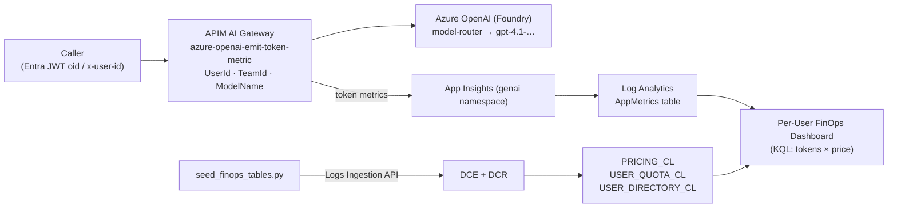

# Per-User FinOps Dashboard

Per-user AI cost attribution for the County Assistant gateway: **who** spent **how much** on
Foundry model calls, priced from real token usage, with budgets and team roll-ups.

It is the per-user adaptation of the Azure-Samples **AI-Gateway FinOps framework** lab and
plugs into the same APIM → Azure OpenAI token-metric pipeline this repo already runs.

---

## 1. What it is based on

Upstream reference: [Azure-Samples/AI-Gateway — `labs/finops-framework/finops-framework.ipynb`](https://github.com/Azure-Samples/AI-Gateway/blob/main/labs/finops-framework/finops-framework.ipynb)
(and its companion `dashboard.bicep`).

The upstream lab:

- Puts **API Management** in front of Azure OpenAI and emits token-usage metrics with the
  `azure-openai-emit-token-metric` policy.
- Stores a **pricing lookup table** (`PRICING_CL`) in Log Analytics with input/output token
  prices per model.
- Ships an **Azure Portal dashboard** (`dashboard.bicep`) whose tiles compute cost from tokens:

  $$\text{cost} = \frac{\text{PromptTokens}\times\text{InputTokensPrice} + \text{CompletionTokens}\times\text{OutputTokensPrice}}{1000}$$

- Attributes that cost by **`ApimSubscriptionId`** — i.e. per APIM subscription / team — and
  compares it to a per-subscription budget table.

We kept the pricing math and the metric pipeline **identical**, and changed *what the cost is
grouped by*.

---

## 2. How we customized it (step by step)

| # | Upstream | This repo |
|---|----------|-----------|
| 1 | Groups cost by `ApimSubscriptionId` | Groups cost by a **`UserId`** dimension — per individual user |
| 2 | Identity = APIM subscription | Identity precedence **Entra `oid` (JWT) → `x-user-id` header → subscription id** |
| 3 | `ModelName` not needed (single model) | Adds a **`ModelName`** dimension = the model the router actually served |
| 4 | `PRICING_CL` only | Adds **`USER_QUOTA_CL`** (per-user budgets) and **`USER_DIRECTORY_CL`** (oid → name) |
| 5 | Manual table creation in the notebook | **`infra/modules/finops.bicep`** provisions tables + ingestion plumbing as IaC |
| 6 | Notebook seeds rows | **`scripts/seed_finops_tables.py`** seeds rows via the Logs Ingestion API |
| 7 | One dashboard.bicep | **`apim/dashboards/per-user-finops-dashboard.bicep`** (3 tiles) + a Workbook query pack |

### Step-by-step of the customization

1. **Emit a per-user identity from the gateway.** The APIM policies
   ([apim/policies/aoai-api.applied.xml](../policies/aoai-api.applied.xml),
   [apim/policies/aoai-api.policy.xml](../policies/aoai-api.policy.xml),
   [ai_demo/apim/per-user-cost-attribution.policy.xml](../../ai_demo/apim/per-user-cost-attribution.policy.xml))
   resolve `userId` with precedence **Entra `oid` → `x-user-id` → subscription id**, then pass it as
   the `UserId` dimension on `azure-openai-emit-token-metric` (namespace `genai`).

2. **Capture the *resolved* model, not the deployment.** Calls go to the `model-router`
   deployment, so the URL path says `model-router`. The policy instead reads the response header
   **`x-ms-served-model`** (e.g. `gpt-4.1-2025-04-14`) into a `ModelName` dimension, with a
   null-safe fallback to the path. This is the join key to `PRICING_CL.Model`, so cost lands on the
   real underlying model.
   > `azure-openai-emit-token-metric` is **inbound-only** (APIM rejects it in `<outbound>`), but it
   > still emits *after* the backend responds, so the `ModelName` expression can read the response
   > header from the inbound section.

3. **Provision the lookup tables as IaC.** [infra/modules/finops.bicep](../../infra/modules/finops.bicep)
   creates the three `_CL` tables on the **existing** Log Analytics workspace (no duplicate
   workspace) plus a Data Collection Endpoint (DCE) and Data Collection Rule (DCR) so rows can be
   pushed via the Logs Ingestion API.

4. **Seed pricing / budgets / directory.** [scripts/seed_finops_tables.py](../../scripts/seed_finops_tables.py)
   uploads the JSON rows in [data/finops/](../../data/finops/).

5. **Group by user in KQL.** [per-user-cost.kql](./per-user-cost.kql) is the upstream pricing query
   re-pivoted from subscription to `UserId`, plus budget, team roll-up, and oid→name variants.

6. **Ship a Portal dashboard.** [per-user-finops-dashboard.bicep](./per-user-finops-dashboard.bicep)
   renders three tiles from those queries, scoped to the existing workspace.

---

## 3. Architecture / data flow



The dashboard joins **live token metrics** (`AppMetrics`) to the **seeded pricing** (`PRICING_CL`)
to compute cost, then optionally joins budgets (`USER_QUOTA_CL`) and friendly names
(`USER_DIRECTORY_CL`).

---

## 4. Tables created

All three live on the existing workspace **`wpcounty-dev-law`**, created by
[infra/modules/finops.bicep](../../infra/modules/finops.bicep). Every table includes a
`TimeGenerated` column; queries take `arg_max(TimeGenerated, *)` per key, so **re-seeding upserts**
(the latest row wins).

| Table | Columns | Purpose | Upstream analogue |
|-------|---------|---------|-------------------|
| `PRICING_CL` | `Model` (string), `InputTokensPrice` (real), `OutputTokensPrice` (real) | Price per **1,000 tokens** for each served model | `PRICING_CL` |
| `USER_QUOTA_CL` | `UserId` (string), `CostQuota` (real) | Monthly USD budget per user | `SUBSCRIPTION_QUOTA_CL` |
| `USER_DIRECTORY_CL` | `UserId` (string), `DisplayName` (string), `Upn` (string) | Maps Entra `oid` GUID → person | *(new)* |

Sample seed rows: [data/finops/pricing.json](../../data/finops/pricing.json),
[user_quota.json](../../data/finops/user_quota.json),
[user_directory.json](../../data/finops/user_directory.json).

> **Pricing key matters.** `PRICING_CL.Model` must contain a row for every value the policy emits in
> `ModelName` — i.e. exact served-model snapshots like `gpt-4.1-2025-04-14`, plus a `model-router`
> fallback row. Snapshot names change over time; to price by *family* instead, normalize the suffix
> in KQL (`replace_regex(ModelName, @"-\d{4}-\d{2}-\d{2}$", "")`) and seed family names.

The **token metrics** themselves live in the platform table `AppMetrics` (not created by us — it is
populated by the APIM diagnostic that forwards the `genai` metric to the workspace). Per-call
dimensions live in its dynamic `Properties` column: `UserId`, `TeamId`, `ModelName`, `API ID`,
`Operation ID`, `Subscription ID`.

---

## 5. The KQL queries

All queries are in [per-user-cost.kql](./per-user-cost.kql); the dashboard embeds A, B, and C.

| Query | Tile | What it answers |
|-------|------|-----------------|
| **A** — AI spend by user (MTD) | Donut | Total cost per user this month |
| **A2** — same, App Insights scope | — | Variant using `customMetrics` (use only when the tile is scoped to the App Insights resource, not the workspace) |
| **B** — spend over time by user | Stacked column | Cost per user per hour |
| **C** — budget vs actual | Column | `CostQuota` vs actual spend per user (joins `USER_QUOTA_CL`) |
| **D** — team roll-up | Bar / pie | Cost per `TeamId` (showback) |
| **E** — friendly names | Grid | Replaces oid GUIDs with names via `USER_DIRECTORY_CL` |

### How a query works (Query A)

```kusto
let pricing = PRICING_CL
    | summarize arg_max(TimeGenerated, *) by Model      // latest price per model
    | project Model, InputTokensPrice, OutputTokensPrice;
AppMetrics
| where TimeGenerated >= startofmonth(now())            // this month
| where Name in ("Prompt Tokens", "Completion Tokens")  // the genai metrics
| extend UserId    = tostring(Properties["UserId"]),    // dimensions are in Properties
         ModelName = tostring(Properties["ModelName"])
| where isnotempty(UserId) and UserId != "anonymous"
| summarize PromptTokens     = sumif(Sum, Name == "Prompt Tokens"),
            CompletionTokens = sumif(Sum, Name == "Completion Tokens")
        by UserId, ModelName
| join kind=inner pricing on $left.ModelName == $right.Model   // price the tokens
| extend InputCost = PromptTokens*InputTokensPrice,
         OutputCost = CompletionTokens*OutputTokensPrice
| summarize InputCost = sum(InputCost), OutputCost = sum(OutputCost) by UserId
| extend TotalCost = round((InputCost + OutputCost) / 1000, 4)  // /1000 → USD
| project UserId, TotalCost
| order by TotalCost desc
```

> **Schema gotcha.** The Log Analytics **workspace** Logs blade uses `AppMetrics`
> (`Sum` / `Properties` / `Name`). The **Application Insights resource** Logs blade uses
> `customMetrics` (`valueSum` / `customDimensions` / `name`). Same data, different schema — the
> dashboard is scoped to the workspace, so it uses `AppMetrics`. There is **no `Namespace` column**;
> the `genai` namespace is a metric grouping, not a queryable column.

---

## 6. How to run it

Resource names below are for the deployed `dev` environment in `rg-county-sc`.

### 6.1 Deploy the tables + dashboard

Wired into `infra/main.bicep` (the `finops` and `perUserDashboard` modules). Pass your own object
id so the seed identity gets **Monitoring Metrics Publisher** on the DCR:

```bash
MYOID=$(az ad signed-in-user show --query id -o tsv)
az deployment group create -g rg-county-sc -f infra/main.bicep -p infra/main.bicepparam \
  -p searchIndexAdminPrincipalId="$MYOID" searchIndexAdminPrincipalType=User
```

Relevant deployment outputs: `finopsLogsIngestionEndpoint`, `finopsDcrImmutableId`,
`finopsPricingStream`, `finopsUserQuotaStream`, `finopsUserDirectoryStream`.

### 6.2 Seed pricing / budgets / directory

```bash
export LOGS_DCR_ENDPOINT=<finopsLogsIngestionEndpoint output>
export LOGS_DCR_IMMUTABLE_ID=<finopsDcrImmutableId output>
uv sync --extra finops
uv run python scripts/seed_finops_tables.py
```

Edit the JSON in [data/finops/](../../data/finops/) (or pass `--pricing/--user-quota/--user-directory`)
to change pricing, budgets, or names. Allow ~1–3 min for rows to appear.

### 6.3 Generate traffic

Any chat call through the gateway with a `x-user-id` header (demo/dev) or an Entra bearer token
(production) produces metrics:

```bash
GW="https://wpcounty-dev-apim-mro5df.azure-api.net/openai/deployments/model-router/chat/completions?api-version=2025-04-01-preview"
curl -s "$GW" -H "api-key: <aoai-internal key>" -H "Content-Type: application/json" \
  -H "x-user-id: alice@county.gov" \
  -d '{"messages":[{"role":"user","content":"How do I apply for a building permit?"}],"max_tokens":80}'
```

Token metrics land in `AppMetrics` within ~1–3 minutes.

---

## 7. Viewing & verifying in the Azure Portal

### 7.1 The dashboard

**Portal → Dashboard → browse shared dashboards → “APIM ❤️ AI Foundry — Per-User FinOps.”**
Three tiles render: *AI cost by user (MTD)*, *AI spend over time by user*, *Budget vs actual by user*.

### 7.2 Inspect / query the custom tables

**Portal → Log Analytics workspace `wpcounty-dev-law` → Logs**, then run, e.g.:

```kusto
PRICING_CL | summarize arg_max(TimeGenerated, *) by Model
USER_QUOTA_CL | summarize arg_max(TimeGenerated, *) by UserId
USER_DIRECTORY_CL | summarize arg_max(TimeGenerated, *) by UserId
```

To confirm metrics are flowing with the `ModelName` dimension populated:

```kusto
AppMetrics
| where TimeGenerated > ago(1h)
| where Name in ("Prompt Tokens","Completion Tokens")
| extend UserId = tostring(Properties["UserId"]), ModelName = tostring(Properties["ModelName"])
| summarize Tokens = sum(Sum) by UserId, ModelName, Name
```

If `ModelName` is blank, the dashboard’s inner join to `PRICING_CL` drops those rows — re-check the
APIM policy is the updated version (emit in inbound with the `ModelName` dimension).

### 7.3 Table schema / retention

**Portal → Log Analytics workspace → Settings → Tables** lists `PRICING_CL`, `USER_QUOTA_CL`,
`USER_DIRECTORY_CL` (type *Custom*, 30-day retention) and lets you inspect columns or adjust
retention. The DCE/DCR that feed them are under **Monitor → Data Collection Endpoints / Rules**
(`wpcounty-dev-finops-dce-…`, `wpcounty-dev-finops-dcr-…`).

---

## 8. What the results mean

- **AI cost by user (MTD)** — month-to-date USD per user. Cost is derived from *actual token
  counts* × *your `PRICING_CL` rates*, so it reflects model usage, not a flat per-call fee. Use it
  for **chargeback** (bill the cost back) or **showback** (visibility only).
- **Spend over time by user** — hourly trend per user; spots spikes, runaway loops, or a single
  user dominating spend.
- **Budget vs actual** — actual MTD spend next to each user’s `CostQuota`. A bar approaching/over its
  quota is the signal to investigate or enforce a limit (the policy already rate-limits tokens per
  user via `azure-openai-token-limit`).

Sample verified output (demo traffic, model `gpt-4.1-2025-04-14`):

| User | MTD cost | Quota |
|------|----------|-------|
| alice@county.gov | $0.00343 | $25 |
| bob@county.gov | $0.00340 | $25 |
| carol@county.gov | $0.00340 | $10 |
| probe@county.gov | $0.00328 | $5 |

> **Identity in the numbers.** In demo/dev the `UserId` is the `x-user-id` header (here an email).
> In production it is the tamper-proof Entra **`oid`** GUID — the same queries work unchanged; add
> rows to `USER_DIRECTORY_CL` (or use Query E) to show names instead of GUIDs.

> **Accuracy caveat.** Cost is only as correct as `PRICING_CL`. Keep a row for every served-model
> snapshot the router can return (plus a `model-router` fallback), or normalize snapshots to a
> family and price the family. Numbers are an estimate for FinOps allocation, not an invoice.
