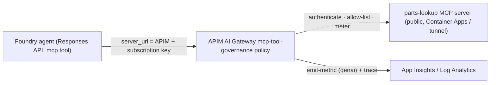

# Runbook — Run the MCP Tool Gateway Path for Real (Foundry agent → APIM → MCP server)

This runbook takes the local MCP & Tools demo
([ai_demo/mcp_tools_gateway.py](../ai_demo/mcp_tools_gateway.py),
[ai_demo/mcp_server/parts_lookup_server.py](../ai_demo/mcp_server/parts_lookup_server.py),
[ai_demo/apim/mcp-tool-governance.policy.xml](../ai_demo/apim/mcp-tool-governance.policy.xml))
and runs it **end-to-end against live Azure** — a Foundry agent that calls an internal
parts-lookup MCP tool **through APIM**, where the gateway authenticates, allow-lists,
and meters every tool call.

## Why "for real" is different from the local smoke test

The `smoke` path runs the MCP client on your laptop, so `localhost:8000` works. The
**Foundry agent runs in Azure** and cannot reach `localhost`. So the real path requires:

1. The MCP server on a **public HTTPS URL**.
2. **APIM in front** as the only governed entry point (auth + tool allow-list + metering).
3. The agent's `server_url` pointed at the **APIM URL**, never the raw server.



## Environment (this repo's dev resources)

| Thing | Value |
| --- | --- |
| Subscription | `b44206b5-80c5-499e-9da8-21f8fa79fb27` |
| Resource group | `rg-county-sc` |
| APIM | `wpcounty-dev-apim-mro5df` (host `wpcounty-dev-apim-mro5df.azure-api.net`) |
| Foundry project | `https://wpcounty-dev-aifoundry-mro5df.services.ai.azure.com/api/projects/county-assistant` |
| Model deployment | `model-router` |

```bash
export SUB=b44206b5-80c5-499e-9da8-21f8fa79fb27
export RG=rg-county-sc
export APIM=wpcounty-dev-apim-mro5df
export APIM_HOST=wpcounty-dev-apim-mro5df.azure-api.net
az account set --subscription "$SUB"
```

## Prerequisites

- `az login` to the subscription above.
- The `mcp` Python package (already installed in `.venv`).
- **Cognitive Services OpenAI User** on the Foundry account for your identity (to call the model).
- One way to expose the server publicly — pick **Phase 1 Option A or B** below.

---

## Phase 1 — Put the MCP server on a public HTTPS URL

Pick **one**. Option A is durable (recommended for a repeatable demo); Option B is fastest.

### Option A — Azure Container Apps (durable)

1. Add a minimal Dockerfile next to the server (`ai_demo/mcp_server/Dockerfile`):

   ```dockerfile
   FROM python:3.12-slim
   WORKDIR /app
   RUN pip install --no-cache-dir "mcp>=1.2"
   COPY parts_lookup_server.py .
   EXPOSE 8000
   CMD ["python", "parts_lookup_server.py"]
   ```

2. Deploy it (creates an environment + external ingress on 8000):

   ```bash
   az extension add -n containerapp --upgrade
   az provider register -n Microsoft.App --wait
   az provider register -n Microsoft.OperationalInsights --wait

   cd ai_demo/mcp_server
   az containerapp up \
     --name parts-mcp \
     --resource-group "$RG" \
     --location swedencentral \
     --ingress external --target-port 8000 \
     --source .
   cd -

   # Capture the public FQDN:
   export MCP_PUBLIC="https://$(az containerapp show -g "$RG" -n parts-mcp \
     --query properties.configuration.ingress.fqdn -o tsv)"
   echo "MCP server public URL: $MCP_PUBLIC/mcp"
   ```

   > Lock it down: the server should only accept traffic that carries the secret APIM
   > injects (see Phase 2 step 5 and the Security section). Container Apps ingress is
   > public by default.

### Option B — Dev tunnel (fastest, ephemeral)

```bash
curl -sL https://aka.ms/DevTunnelCliInstall | bash
devtunnel user login            # use your Azure identity

# In a dedicated terminal, run the server, then host a tunnel on 8000:
# terminal 1:
source .venv/bin/activate && python ai_demo/mcp_server/parts_lookup_server.py
# terminal 2:
devtunnel host -p 8000 --allow-anonymous     # prints a public https URL
export MCP_PUBLIC="https://<your-tunnel-id>-8000.<region>.devtunnels.ms"
echo "MCP server public URL: $MCP_PUBLIC/mcp"
```

> A tunnel with `--allow-anonymous` is open to anyone with the URL and lives only
> while the command runs. Fine for a short demo; use Option A for anything durable.

---

## Phase 2 — Register the server behind APIM with the governance policy

### 1. Backend → the public MCP server

```bash
az apim backend create -g "$RG" --service-name "$APIM" \
  --backend-id mcp-parts-backend \
  --url "$MCP_PUBLIC" --protocol http
```

### 2. API (URL suffix `parts-mcp`) + the MCP methods as operations

```bash
az apim api create -g "$RG" --service-name "$APIM" \
  --api-id parts-mcp --path parts-mcp --display-name "Parts MCP (governed)" \
  --service-url "$MCP_PUBLIC" --protocols https --subscription-required true

# MCP streamable-http uses POST (calls), GET (SSE stream), DELETE (session end) on /mcp
for M in get post delete; do
  az apim api operation create -g "$RG" --service-name "$APIM" \
    --api-id parts-mcp --operation-id "mcp-$M" \
    --display-name "MCP $M" --method "${M^^}" --url-template "/mcp"
done
```

The client-facing gateway URL is therefore:
**`https://wpcounty-dev-apim-mro5df.azure-api.net/parts-mcp/mcp`**

### 3. Named Values so the policy applies

The policy's optional Entra JWT block resolves `{{entra-openid-config}}` and
`{{entra-audience}}` **at apply time**, even though it only *executes* when a bearer is
present (the demo sends a subscription key, not a bearer). Create both so the apply
succeeds — the audience value is irrelevant until you wire real JWT auth:

```bash
TENANT=$(az account show --query tenantId -o tsv)
az apim nv create -g "$RG" --service-name "$APIM" \
  --named-value-id entra-openid-config --display-name entra-openid-config \
  --value "https://login.microsoftonline.com/$TENANT/v2.0/.well-known/openid-configuration" 2>/dev/null || true
az apim nv create -g "$RG" --service-name "$APIM" \
  --named-value-id entra-audience --display-name entra-audience \
  --value "api://parts-mcp-demo" 2>/dev/null || true
```

### 4. Apply the governance policy to the API

```bash
python3 -c "import json;xml=open('ai_demo/apim/mcp-tool-governance.policy.xml').read();json.dump({'properties':{'format':'rawxml','value':xml}},open('/tmp/mcp-policy.json','w'))"
az rest --method put \
  --url "https://management.azure.com/subscriptions/$SUB/resourceGroups/$RG/providers/Microsoft.ApiManagement/service/$APIM/apis/parts-mcp/policies/policy?api-version=2022-08-01" \
  --headers "Content-Type=application/json" --body @/tmp/mcp-policy.json
```

This activates: subscription-key auth, identity resolution, JSON-RPC parsing, the
**tool allow-list** (`lookup_part`, `search_parts` — anything else → 403), per-user
rate limit, and the `genai` metric + trace.

### 5. (Recommended) Make the server reject non-APIM traffic

So the public server only answers calls that came through the gateway, have APIM inject
a shared secret and verify it server-side. Uncomment in
[ai_demo/apim/mcp-tool-governance.policy.xml](../ai_demo/apim/mcp-tool-governance.policy.xml):

```xml
<set-header name="X-Gateway-Token" exists-action="override">
  <value>{{mcp-backend-token}}</value>
</set-header>
```

```bash
az apim nv create -g "$RG" --service-name "$APIM" \
  --named-value-id mcp-backend-token --display-name mcp-backend-token \
  --value "$(openssl rand -hex 24)" --secret true
```

Then have the server return 401 unless `X-Gateway-Token` matches (read it from an env
var you set on the Container App). Re-apply the policy after editing.

### 6. Product + subscription → an API key

```bash
az apim product create -g "$RG" --service-name "$APIM" \
  --product-id county-mcp --product-name "County MCP" \
  --state published --subscription-required true --approval-required false
az apim product api add -g "$RG" --service-name "$APIM" \
  --product-id county-mcp --api-id parts-mcp

az rest --method put \
  --url "https://management.azure.com/subscriptions/$SUB/resourceGroups/$RG/providers/Microsoft.ApiManagement/service/$APIM/subscriptions/county-mcp-demo?api-version=2024-05-01" \
  --headers "Content-Type=application/json" \
  --body '{"properties":{"displayName":"county-mcp-demo","scope":"/products/county-mcp"}}'

export APIM_KEY=$(az rest --method post \
  --url "https://management.azure.com/subscriptions/$SUB/resourceGroups/$RG/providers/Microsoft.ApiManagement/service/$APIM/subscriptions/county-mcp-demo/listSecrets?api-version=2024-05-01" \
  --query primaryKey -o tsv)
echo "APIM key length: ${#APIM_KEY}"
```

### 7. Verify the gateway path before involving the agent

```bash
MCP_SERVER_GATEWAY_URL="https://$APIM_HOST/parts-mcp/mcp" \
APIM_SUBSCRIPTION_KEY="$APIM_KEY" \
python ai_demo/mcp_tools_gateway.py smoke
```

You should see the advertised tools and the `lookup_part` result — now flowing
**through APIM**, authenticated and metered.

---

## Phase 3 — Point the Foundry agent at the gateway

Create `ai_demo/.env`:

```bash
cat > ai_demo/.env <<EOF
PROJECT_ENDPOINT=https://wpcounty-dev-aifoundry-mro5df.services.ai.azure.com/api/projects/county-assistant
MODEL_ROUTER_DEPLOYMENT=model-router
MCP_SERVER_GATEWAY_URL=https://$APIM_HOST/parts-mcp/mcp
APIM_SUBSCRIPTION_KEY=$APIM_KEY
EOF
```

Run the agent:

```bash
source .venv/bin/activate
python ai_demo/mcp_tools_gateway.py
```

The model receives the parts-lookup tools (fetched from the APIM URL with the key),
decides to call `lookup_part`, and the call is authenticated, allow-listed, and metered
by APIM before it reaches the server. Expected output:

```
Q: Look up the PIC32MZ2048EFH144 and tell me its max clock and flash size.
A: ... 200 MHz ... 2048 KB flash ...
  [gateway-governed tool call] lookup_part
  tokens: <n>
```

---

## Verify the governance worked

**Allow-list (negative test).** Ask for a tool that isn't approved — APIM returns 403
before the server is touched:

```bash
curl -s -o /dev/null -w "%{http_code}\n" \
  "https://$APIM_HOST/parts-mcp/mcp" \
  -H "Ocp-Apim-Subscription-Key: $APIM_KEY" -H "Content-Type: application/json" \
  -d '{"jsonrpc":"2.0","id":1,"method":"tools/call","params":{"name":"delete_part","arguments":{}}}'
# -> 403
```

**Metering + audit (Log Analytics).** Open `wpcounty-dev-law` → **Logs** and run:

```kusto
AppMetrics
| where Name == "McpToolCall"
| extend ToolName = tostring(Properties["ToolName"]),
         UserId   = tostring(Properties["UserId"])
| summarize calls = sum(Sum) by ToolName, UserId, bin(TimeGenerated, 5m)
| order by TimeGenerated desc
```

```kusto
ApiManagementGatewayLogs
| where OperationName startswith "mcp"
| project TimeGenerated, ResponseCode, Url
| order by TimeGenerated desc
```

The MCP tool calls show up in the **same** `genai`-namespace metric and gateway logs as
your model-token usage — same observability, no new model.

---

## Security notes

- **Never expose the raw MCP server as the agent's `server_url`.** Always the APIM URL,
  so auth/allow-list/metering can't be bypassed.
- **Restrict the backend** (Phase 2 step 5) so the public server only answers
  gateway-injected traffic; otherwise the tunnel/Container App URL is callable directly.
- **Treat the APIM key as a secret.** It's printed by length only above; don't commit
  `ai_demo/.env` (it's already covered by the repo `.gitignore` patterns for `.env`).
- **Tighten the allow-list per environment** — edit the `new[] { ... }` set in the
  policy; prefer `tools/list` filtering too if you want to hide unapproved tools.

---

## Teardown

```bash
# APIM artifacts
az apim product api remove -g "$RG" --service-name "$APIM" --product-id county-mcp --api-id parts-mcp
az rest --method delete --url "https://management.azure.com/subscriptions/$SUB/resourceGroups/$RG/providers/Microsoft.ApiManagement/service/$APIM/subscriptions/county-mcp-demo?api-version=2024-05-01"
az apim product delete -g "$RG" --service-name "$APIM" --product-id county-mcp --delete-subscriptions true -y
az apim api delete -g "$RG" --service-name "$APIM" --api-id parts-mcp -y
az apim backend delete -g "$RG" --service-name "$APIM" --backend-id mcp-parts-backend -y

# Server (Option A)
az containerapp delete -g "$RG" -n parts-mcp -y
# Server (Option B): stop the devtunnel host process
```

---

## Troubleshooting / caveats

- **`mcp` tool type not supported by the deployment/region.** The hosted MCP tool on the
  Azure OpenAI Responses API is relatively new. If `responses.create(..., tools=[{"type":"mcp"...}])`
  errors, you have two governed-path fallbacks that still prove the gateway:
  1. `python ai_demo/mcp_tools_gateway.py smoke` — the MCP client calls the tool through
     APIM directly (auth + allow-list + metering all exercised), or
  2. build an **Azure AI Agent** (Agents SDK) and attach the MCP tool pointed at the same
     APIM URL.
- **307 redirects to `/mcp`.** Keep the operation template exactly `/mcp` and the backend
  `--service-url` at the server root so the path resolves to `/mcp` (no trailing slash).
- **401 from APIM.** The product/subscription isn't linked, or the key is wrong — re-run
  Phase 2 step 6 and confirm `subscription-required true` on the API.
- **403 on a tool you expect to work.** It isn't in the policy allow-list — add it to the
  `new[] { "lookup_part", "search_parts" }` set and re-apply.
- **Empty metrics.** APIM needs a diagnostic setting forwarding Logs/Metrics to
  `wpcounty-dev-law`, and `emit-metric` requires an App Insights logger on APIM.
