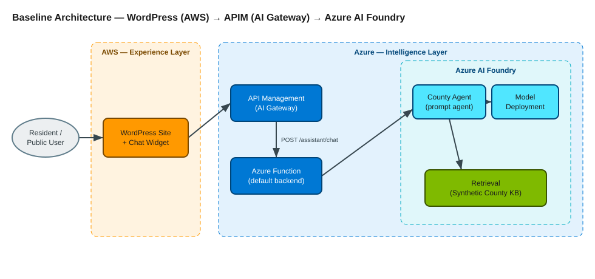
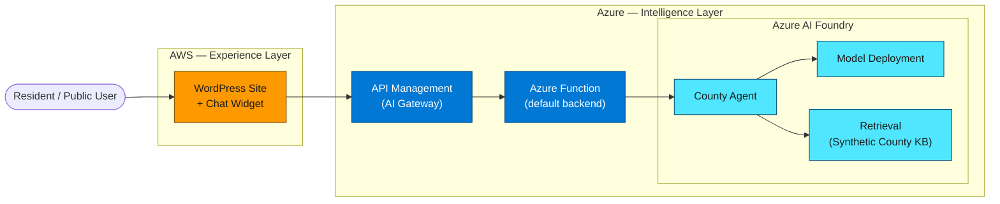
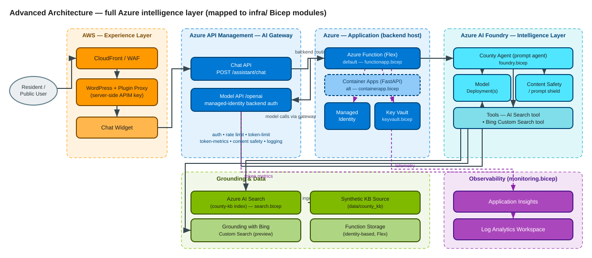
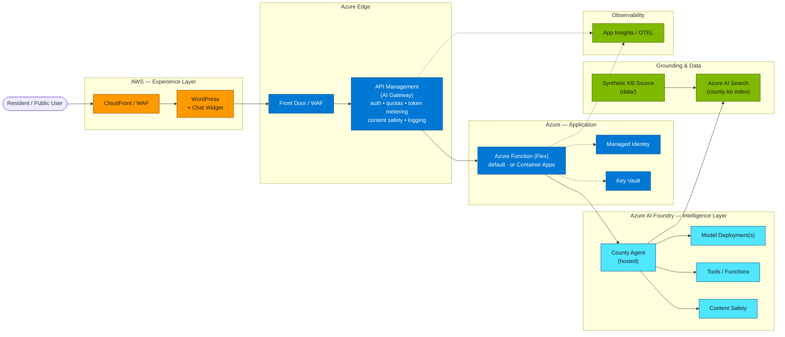
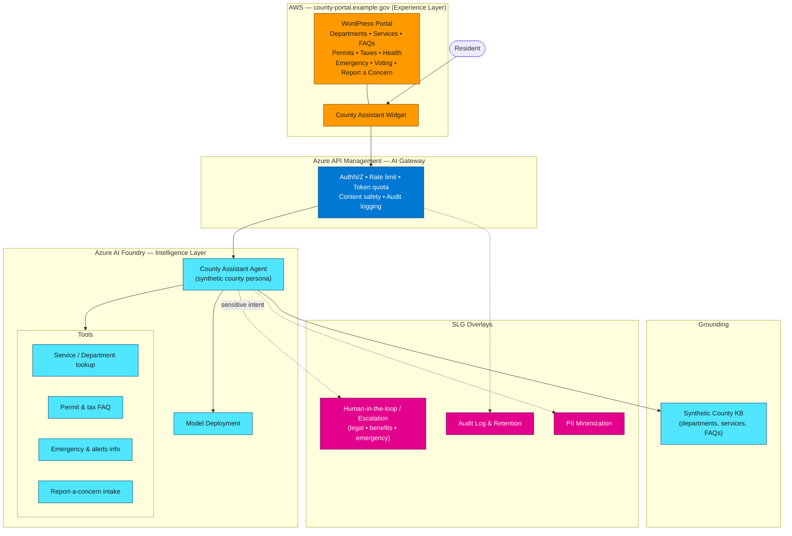
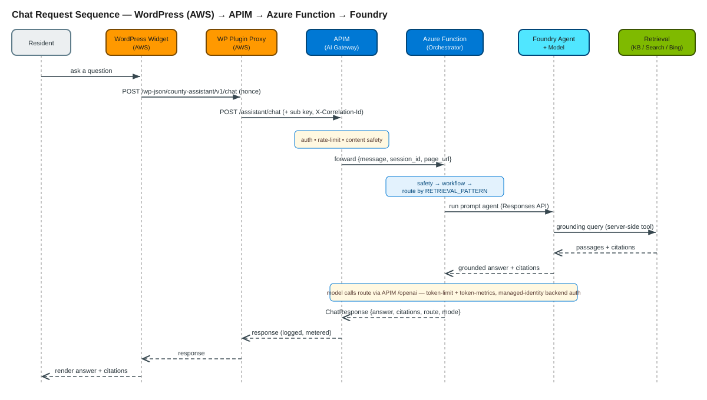
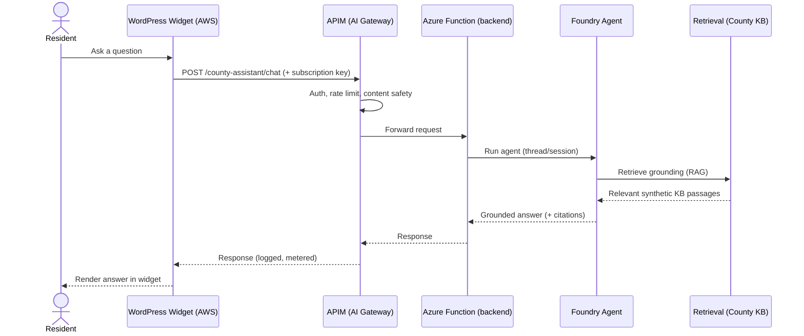

# Reference Architecture

> **Slide-quality diagrams** for the County Assistant prototype. Three views:
> **baseline**, **advanced**, and **county-government tailored**. All content is
> synthetic; no real county content is depicted.
>
> Editable [draw.io](diagrams/) sources and SVG renders for these diagrams live in
> [docs/diagrams/](diagrams/). The Mermaid versions below render inline on GitHub.

Positioning, repeated for slides:

> **This architecture separates the experience layer from the intelligence layer.**
> **WordPress on AWS remains the front door, while Azure AI Foundry becomes the brain.**

---

## 1. Baseline architecture

The minimal end-to-end path: a WordPress widget calls APIM, which fronts a thin backend that
talks to a Foundry agent grounded on a small knowledge base.



> Editable source: [baseline-architecture.drawio](diagrams/baseline-architecture.drawio)



---

## 2. Advanced architecture

Adds production-grade edges: CDN/WAF in front of WordPress, managed identity, Key Vault,
Azure AI Search as the retrieval store, tools, content safety, and observability.



> Editable source: [advanced-architecture.drawio](diagrams/advanced-architecture.drawio)



---

## 3. County-government tailored architecture

Maps the same pattern to county portal categories (synthetic) and adds SLG overlays:
escalation/human-in-the-loop, audit logging, and PII minimization.



---

## Request lifecycle (sequence)



> Editable source: [chat-sequence.drawio](diagrams/chat-sequence.drawio)



> All diagrams are **illustrative**. Colors and Azure/AWS service choices are
> suggestions; final services and network topology are decided per deployment.

---

## Decision record — Gateway: APIM + WordPress plugin proxy

**Decision:** For the SLED (State / Local / Education / Government) scenario, the
production front door is the **WordPress plugin proxy (AWS-side) → Azure API
Management AI Gateway (Azure-side) → Azure AI Foundry**. These are complementary
layers, not alternatives. **AWS API Gateway is explicitly not used.**

```
Browser → WordPress plugin proxy (AWS, hides key) → APIM AI Gateway (Azure, governs) → Foundry
```

**Why APIM (not "no gateway" or AWS API Gateway):**

- **Auditability & accountability** — Public-records and oversight expectations
  require central logging of every citizen interaction across all front-ends.
- **Cost control / FinOps** — APIM AI-gateway token-based throttling and quotas
  bound model spend against a fixed agency budget. The plugin proxy and AWS API
  Gateway cannot meter tokens or model cost.
- **Responsible AI** — Content-safety / prompt-shield controls sit in front of the
  model in APIM, supporting SLED procurement requirements.
- **Governance next to the model** — Model and data live in Azure; keeping the AI
  gateway, managed identity, and logging in Azure avoids stretching trust across
  AWS → Azure.
- **Defense in depth** — The plugin proxy keeps the APIM subscription key
  server-side on AWS so it never reaches the browser.

**When APIM can be skipped:** throwaway internal demos or pilots with no public
traffic and no budget/audit requirements. For any resident-facing deployment,
APIM stays in.

**Independence:** This gateway decision holds regardless of whether the
intelligence layer is a FastAPI orchestrator or a Foundry prompt agent — APIM
sits in front of either.
