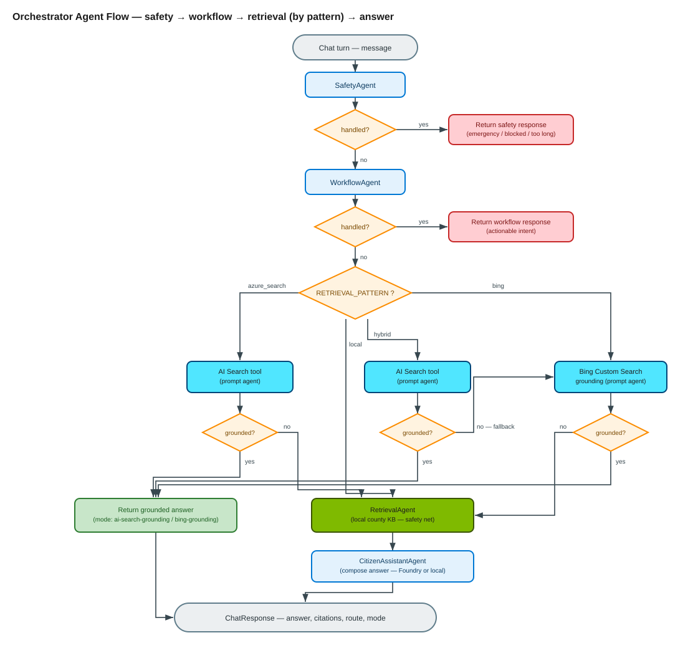
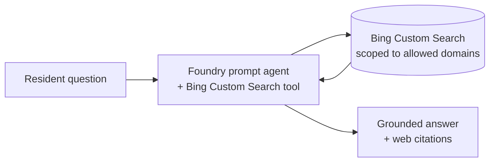
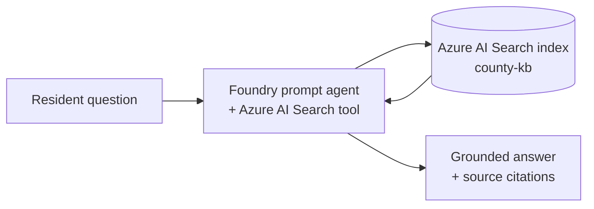
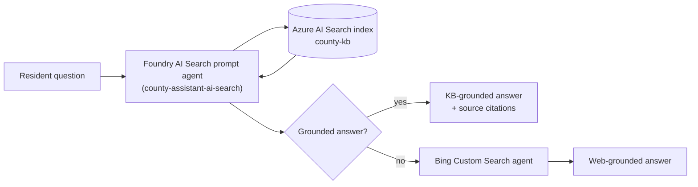
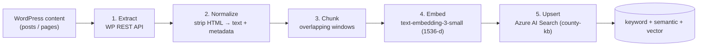

# Retrieval Patterns

> How the County Assistant grounds its answers, the three retrieval patterns it
> supports, and how to switch between them. All demo content is **synthetic**.
> The *County of Westvale* is our created WordPress site; the *staging* profile
> represents a generic customer staging WordPress site grounded **only** via
> public web search (no scraping or ingestion). The real staging domain is
> supplied at runtime via `BING_ALLOWED_DOMAINS` and is never hard-coded.

The chatbot is grounded — it answers from sources, not from model memory. Three
retrieval patterns are implemented and switchable at runtime via environment
variables. The orchestrator ([src/app/agents/orchestrator.py](src/app/agents/orchestrator.py))
selects the path from [Settings.effective_retrieval_pattern](src/app/config/settings.py),
which **degrades gracefully** (any unconfigured cloud path falls back to the
offline local retriever) so the prototype always runs.

The orchestrator routes every turn through safety and workflow checks first, then
grounds by the configured pattern, falling back to the local KB safety net when a
cloud path is unavailable:



> Editable source: [orchestrator-flow.drawio](diagrams/orchestrator-flow.drawio)

---

## 1. The three patterns

| # | Pattern | `RETRIEVAL_PATTERN` | Grounding source | Answer composed by |
|---|---------|---------------------|------------------|--------------------|
| 1 | **Bing Custom Search** | `bing` | Curated public web (allowed domains) via Grounding with Bing Custom Search (preview) | Foundry prompt agent (tool runs server-side) |
| 2 | **Azure AI Search (RAG)** | `azure_search` | Ingested WordPress content in an Azure AI Search index | **Foundry AI Search tool** (prompt agent) by default; opt-in custom retriever + `gpt-4o-mini` |
| 3 | **Hybrid** | `hybrid` | Azure AI Search first → Bing Custom Search **fallback** when the index has no grounded answer | **Foundry AI Search tool** (prompt agent); Bing prompt agent on fallback. Opt-in custom retriever + `gpt-4o-mini` via `AZURE_SEARCH_USE_CUSTOM_RETRIEVER` |

> There is also a fourth value, `local`, used as the **offline default** and the
> universal fallback. It runs the in-memory retriever over
> [data/county_kb](data/county_kb) so the demo works with zero cloud config.

### Pattern 1 — Bing Custom Search (grounding)



The **Bing Search / Bing Custom Search REST APIs were retired (August 2025)**. The
supported path is the **Grounding with Bing Custom Search** tool (preview)
attached to a Foundry *prompt agent*. The agent is created with the
`azure-ai-projects` SDK (`create_version` + `PromptAgentDefinition` +
`BingCustomSearchPreviewTool`) and invoked through the OpenAI **Responses API**
(`project.get_openai_client().responses.create(..., extra_body={"agent_reference": ...})`).
The tool executes server-side and returns an answer plus URL citation annotations
scoped to the domains configured in the Bing Custom Search instance.
See [src/app/agents/bing_grounding.py](src/app/agents/bing_grounding.py).

> **Prompt agents vs hosted agents.** This prototype uses **prompt agents**
> (server-side agents created with the Azure AI Projects SDK and invoked via the
> Responses API) — *not* Agent Framework "hosted agents" (the in-process
> `FoundryChatClient`). The two are distinct surfaces in Foundry.
>
> **Preview + limits.** `BingCustomSearchPreviewTool` is in preview. The Bing
> grounding tools require normal outbound network access and do **not** work
> behind a VPN or private endpoint. Per the Bing tool terms, both the website
> URLs and the Bing query URLs from the citation annotations must be displayed —
> the client surfaces the annotation links rather than asking the model to invent
> citations.

> **Indexing caveat (important for .gov / public sector).** Bing Custom Search only
> returns results for domains/pages that are **public and already indexed by Bing**.
> A locally hosted or brand-new site (e.g. the created Westvale demo) and most
> **staging** subdomains are **not** indexed, so the tool returns no results there.
> Pattern 1 is therefore appropriate for a **live, public, Bing-indexed** county
> site only. For owned content (created site or customer staging/prod), use
> **Pattern 2 / 3 (Azure AI Search RAG)**, which has no indexing dependency and
> stays inside the Azure compliance boundary. Full breakdown:
> [docs/bing-custom-search-limitations.md](bing-custom-search-limitations.md).

The Bing infra is provisioned (resource `county-bing-cs` SKU `G2` + Foundry
connection `county-bing-custom`); switching to it later needs only env vars
(`BING_CONNECTION_NAME`, `BING_CUSTOM_SEARCH_INSTANCE_NAME`,
`BING_GROUNDING_AGENT_NAME`) once a real indexed domain + portal configuration
instance exist. The allowed domains come from the Bing Custom Search instance and
can be overridden at runtime via `BING_ALLOWED_DOMAINS`.

### Pattern 2 — Azure AI Search (RAG)



**By default this pattern grounds via the Foundry AI Search tool** — a *prompt
agent* created with the `azure-ai-projects` SDK (`create_version` +
`PromptAgentDefinition` + `AzureAISearchTool`) and invoked through the OpenAI
**Responses API** (`responses.create(..., tool_choice="required", extra_body={"agent_reference": ...})`).
The tool runs the retrieval server-side against the index referenced by a project
connection and returns an answer plus citation annotations. See
[src/app/agents/ai_search_grounding.py](src/app/agents/ai_search_grounding.py).

> **Opt-in custom retriever.** The in-repo retriever
> ([src/app/rag/retriever.py](src/app/rag/retriever.py)) + `gpt-4o-mini` chat
> completions remains available for demos and offline runs. Enable it with
> `AZURE_SEARCH_USE_CUSTOM_RETRIEVER=true`; otherwise Pattern 2 uses the Foundry
> AI Search tool. If the tool is unavailable, the orchestrator degrades to the
> custom retriever and then the offline local index.

Classic RAG ingests WordPress content into an Azure AI Search index, retrieved
per query (keyword + semantic + optional vector). See
[src/app/rag/retriever.py](src/app/rag/retriever.py) and
[src/app/agents/citizen_assistant.py](src/app/agents/citizen_assistant.py).

**This is the pattern used for the synthetic County of Westvale site**, whose
content is safe to index.

### Pattern 3 — Hybrid (Azure AI Search grounding → Bing fallback)



By default, Hybrid grounds on the Azure AI Search index **through the same Foundry
AI Search tool / prompt agent as Pattern 2** (`county-assistant-ai-search`) — **not**
the in-repo retriever. When that prompt agent returns a grounded answer, Hybrid uses
it (`mode=ai-search-grounding`). When the AI Search tool is unavailable or returns no
grounded answer, Hybrid **falls back to Grounding with Bing Custom Search**
(`mode=bing-grounding`) for fresh/edge content. This keeps grounding server-side in
Foundry and surfaces agent runs in the portal's **Traces** tab.

> **Opt-in custom-retriever variant.** Set `AZURE_SEARCH_USE_CUSTOM_RETRIEVER=true`
> to make Hybrid use the in-repo `AzureAISearchRetriever` + `gpt-4o-mini` instead of
> the Foundry tool. In that mode the score-based fallback applies: when KB results
> are too few or weak it falls back to Bing, tunable via `HYBRID_MIN_RESULTS` and
> `HYBRID_MIN_SCORE` (decision in `Orchestrator._needs_fallback`). If neither cloud
> path is configured, Hybrid degrades to the offline local index so the demo always
> runs. See [src/app/agents/orchestrator.py](src/app/agents/orchestrator.py).

---

## 2. How to switch patterns

Switching is by environment variable — no code change, no redeploy of code. **But
where you set the variable matters.** There are two config layers:

- **Live deployed Function** (what the WordPress demo and real clients hit) — change it
  with the chained `az functionapp config appsettings set ... && restart && health-poll`
  command, or `./wp-control.sh pattern <p>` for the pattern alone. See the full,
  explained command in [Deployment guide §6](deployment-guide.md#6-switching-retrieval-patterns).
- **A backend you run locally** (`uv run uvicorn ...`) — set the variables in your shell
  or `.env`. The `export` examples below apply to this local case.

```bash
# Pattern 1 — Bing Custom Search grounding (requires a prompt agent or connection)
export RETRIEVAL_PATTERN=bing
export BING_GROUNDING_ENABLED=true
export BING_GROUNDING_AGENT_NAME="county-assistant-bing-grounding"   # or BING_CONNECTION_NAME + BING_CUSTOM_SEARCH_INSTANCE_NAME

# Pattern 2 — Azure AI Search (Foundry AI Search tool by default)
export RETRIEVAL_PATTERN=azure_search
export AZURE_SEARCH_CONNECTION_NAME="<project-search-connection>"   # or AZURE_SEARCH_AGENT_NAME
export AZURE_SEARCH_INDEX=county-kb
# Opt-in: use the in-repo custom retriever instead of the AI Search tool
# export AZURE_SEARCH_USE_CUSTOM_RETRIEVER=true
# export AZURE_SEARCH_ENDPOINT="https://<search>.search.windows.net"

# Pattern 3 — Hybrid
export RETRIEVAL_PATTERN=hybrid
export AZURE_SEARCH_ENDPOINT="https://<search>.search.windows.net"
export BING_GROUNDING_ENABLED=true
export BING_CONNECTION_NAME="county-bing-custom"
export BING_CUSTOM_SEARCH_INSTANCE_NAME="county-bing-custom"
export HYBRID_MIN_RESULTS=1
# Semantic reranker score (0-4 scale). Genuine KB topic hits rerank ~2.8+;
# off-topic/missing content tops out ~1.3-1.7, so 2.0 routes misses to Bing.
export HYBRID_MIN_SCORE=2.0

# Offline default (no cloud)
export RETRIEVAL_PATTERN=local
```

Switching the **demo site** (and its recommended pattern) for a **local** backend is one
command (it edits `.env` only — **not** the deployed Function):

```bash
uv run python scripts/set_demo_site.py westvale          # synthetic site → hybrid
uv run python scripts/set_demo_site.py staging           # staging site   → bing
uv run python scripts/set_demo_site.py staging --write .env
```

To change the demo site on the **live Function**, use the chained `az` command in
[Deployment guide §6](deployment-guide.md#6-switching-retrieval-patterns) (it sets the
pattern and the site together).

See [scripts/set_demo_site.py](scripts/set_demo_site.py) and the site profiles in
[src/app/agents/site_profiles.py](src/app/agents/site_profiles.py). The widget reads
the active profile from `GET /api/site` and self-configures its title/greeting, so
the **same** WordPress page reflects whichever site the backend is running.

---

## 3. Comparison for this use case (SLED county portal)

### Pros / cons

| Aspect | 1 · Bing Custom Search | 2 · Azure AI Search (RAG) | 3 · Hybrid |
|--------|------------------------|---------------------------|------------|
| **Freshness** | ✅ Always current (live web) | ⚠️ As fresh as last ingest | ✅ Current via fallback |
| **Content control / accuracy** | ⚠️ Whatever is published on the site | ✅ Curated, chunked, governed | ✅ Curated first, web only as backup |
| **Answer grounding precision** | ⚠️ Page-level, less precise | ✅ Chunk-level, precise citations | ✅ Best of both |
| **Setup effort** | ✅ Low (no pipeline) | ⚠️ Build + run ingestion pipeline | ❌ Highest (both) |
| **Works on a site you can't ingest** | ✅ Yes (e.g. live `.gov`) | ❌ No | ⚠️ Only via the Bing leg |
| **Offline / air-gapped demo** | ❌ Needs internet + agent | ⚠️ Needs the index | ⚠️ Needs index (+ internet for fallback) |
| **Handles "long tail" questions** | ✅ Whole public site | ❌ Only what's indexed | ✅ Falls back to web |
| **Determinism / repeatability** | ❌ Web results vary | ✅ Stable index | ⚠️ Mixed |
| **PII / data-residency exposure** | ✅ No content copied into Azure | ⚠️ Content stored in Search (region-bound) | ⚠️ Same as RAG for the indexed part |
| **Operational moving parts** | Agent + Bing config | Search + embeddings + ingestion | All of the above |

### When to choose which

- **Choose Pattern 1 (Bing)** when the source site is public and authoritative, you
  must not copy/ingest its content, and freshness matters more than chunk-level
  precision. **→ Demoable on BOTH the created Westvale site and the staging site.**
- **Choose Pattern 2 (RAG)** when you own the content, need precise citations and
  governance, and can run an ingestion pipeline. **→ County of Westvale.**
- **Choose Pattern 3 (Hybrid)** for the best resident experience on an owned site:
  curated answers first, with a web safety net for gaps. Highest operational cost.

---

## 4. Cost comparison (indicative)

> Indicative **list** prices to compare *relative* cost; confirm exact figures in
> the [Azure Pricing Calculator](https://azure.microsoft.com/pricing/calculator/).
> Full breakdown: [docs/cost-model.md](docs/cost-model.md).

| Cost driver | 1 · Bing | 2 · RAG | 3 · Hybrid |
|-------------|----------|---------|------------|
| LLM tokens (`gpt-4o-mini`) | Per answer | Per answer (+ larger prompt from chunks) | Per answer |
| Embeddings (`text-embedding-3-small`) | — | Ingest-time (+ per query if vector) | Ingest-time (+ per query) |
| **Azure AI Search** | **Not required** | Required (Basic ≈ fixed monthly) | Required |
| Grounding with Bing Custom Search | Per call (metered) | — | Per **fallback** call only |
| Ingestion pipeline compute | — | Periodic job | Periodic job |
| **Relative TCO** | **Lowest fixed cost** | Medium (fixed Search + ingest) | Highest |

Key point: **Pattern 1 has the lowest fixed cost** (no Search resource, no
ingestion), trading a per-call Bing charge. **Pattern 2/3 add a roughly fixed
monthly Search cost** plus ingestion compute. The shared LLM token cost is similar
across patterns, though RAG sends larger prompts (retrieved chunks).

---

## 5. Data ingestion pipeline (Patterns 2 & 3 only)

Patterns 2 and 3 require WordPress content in the Azure AI Search index. **Pattern 1
needs no ingestion.** For the staging site we deliberately do **not** ingest.



For the prototype, source content lives as Markdown in
[data/county_kb](data/county_kb) and steps 3–5 are implemented in
[scripts/index_kb_to_search.py](scripts/index_kb_to_search.py)
(chunking in [src/app/rag/chunking.py](src/app/rag/chunking.py), embeddings in
[src/app/rag/embeddings.py](src/app/rag/embeddings.py)).

### Steps

1. **Extract** — Pull published pages/posts from WordPress via the
   **WP REST API** (`/wp-json/wp/v2/pages`, `/wp-json/wp/v2/posts`). This is the
   recommended source for an **owned** site — structured JSON with titles, URLs,
   and revision dates. *(No HTML scraping required — see
   [§6 Do we need a web scraper?](#6-do-we-need-a-web-scraper).)*
2. **Normalize** — Strip HTML to clean text; capture `title`, `url`, `category`,
   and `department` metadata (mirrors the Markdown front matter the prototype uses).
3. **Chunk** — Split into overlapping word windows (`RAG_CHUNK_SIZE`,
   `RAG_CHUNK_OVERLAP`) so retrieval returns focused, citable passages.
4. **Embed** — Generate 1536-dim vectors with `text-embedding-3-small` through the
   Foundry account endpoint (enables vector / hybrid retrieval).
5. **Upsert** — Create/update the `county-kb` index (keyword + semantic + vector)
   and upload the chunks.

Run it:

```bash
export AZURE_SEARCH_ENDPOINT="https://<search>.search.windows.net"
export AZURE_SEARCH_INDEX=county-kb
export RAG_VECTOR_ENABLED=true
export AZURE_AI_PROJECT_ENDPOINT="https://<acct>.services.ai.azure.com/api/projects/<proj>"
export AZURE_EMBEDDING_DEPLOYMENT=text-embedding-3-small
uv run --extra rag python scripts/index_kb_to_search.py
```

**Refresh strategy:** schedule the pipeline (e.g. nightly) or trigger on WordPress
publish webhooks. Because upserts are keyed by chunk id, re-running is idempotent.

---

## 6. Do we need a web scraper?

**No HTML scraper is required for any of the three patterns.**

| Pattern | Scraper needed? | Why |
|---------|-----------------|-----|
| 1 · Bing Custom Search | ❌ No | The grounding tool searches the live web server-side; nothing is fetched/parsed by us. |
| 2 · Azure AI Search (RAG) | ❌ No | Ingest **owned** WordPress content via the structured **WP REST API**, not by scraping rendered HTML. |
| 3 · Hybrid | ❌ No | Combines the two above; neither leg scrapes. |

A scraper would only be warranted to ingest a site that exposes **no API/feed and
is not yours to query** — explicitly **not** our case. For the **staging site** we
use Pattern 1 only, so there is **no ingestion and no scraping** of its domain.

---

## 7. Mapping to the two demo sites

| Demo site | Hosting | `DEMO_SITE_PROFILE` | Recommended pattern | Ingestion |
|-----------|---------|---------------------|---------------------|-----------|
| **County of Westvale** (created, synthetic) | Local / Azure | `westvale` | `hybrid` (RAG + Bing fallback); also demos `bing` | WP REST → Search |
| **Customer staging** (generic) | External staging host | `staging` | `bing` (Custom Search grounding) | **None** (by design) |

> The real staging domain is provided at deploy time via `BING_ALLOWED_DOMAINS`
> and the Bing Custom Search instance; it is never stored in this repository.

See [docs/deployment-guide.md](docs/deployment-guide.md) to run each, and
[src/app/agents/site_profiles.py](src/app/agents/site_profiles.py) for the per-site
prompts, greetings, and allowed domains. The Foundry prompt agents are created on
demand from the SDK by the orchestrator ([src/app/agents](../src/app/agents)); §2
above lists the environment variables that provision or reference them.
