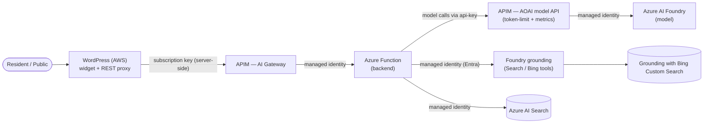

# Security & Governance

> Security posture, identity, and governance for the County Assistant prototype.
> This is a **prototype on synthetic data** (County of Westvale); it demonstrates
> controls suitable for government workloads but makes **no compliance claims**. Deeper
> government-specific overlays (CJIS/IRS-1075/StateRAMP considerations, residency, audit)
> are in [docs/security-and-government-overlays.md](docs/security-and-government-overlays.md).

Design principle: **the experience layer (WordPress on AWS) holds no secrets and
talks to no model directly.** Every request flows through an AI gateway to an
identity-bound backend. Keys never reach the browser.

---

## 1. Trust boundaries and request flow

- **Browser → WordPress:** the widget calls the plugin's **server-side proxy**
  (`/wp-json/county-assistant/v1/chat`), which validates a WordPress **nonce** and
  injects the APIM subscription key. The key is **never** sent to the browser.
  See [wordpress/plugin/includes/class-rest-proxy.php](wordpress/plugin) and
  [docs/wordpress-integration.md](docs/wordpress-integration.md).
- **WordPress → APIM:** the AI gateway enforces the subscription key, rate limits,
  and (recommended) content safety / token policies
  ([apim/policies](apim/policies)).
- **APIM → Function → Foundry/Search:** the backend authenticates downstream with a
  **user-assigned managed identity** — **no keys, no connection strings**.
- **Function → APIM (AOAI model API) → Foundry:** chat-completions and embeddings
  are routed back through APIM's **`/openai`** API, where `azure-openai-token-limit`
  and `azure-openai-emit-token-metric` apply and APIM calls the Foundry model with
  its own **system-assigned managed identity** (no model key on the wire). Toggled
  by `AZURE_OPENAI_GATEWAY_ENDPOINT` / `AZURE_OPENAI_GATEWAY_KEY`; when unset the
  backend calls Foundry directly with managed identity. The Responses-API grounding
  tools (Bing / AI Search) still call the Foundry project endpoint directly.

---

## 2. Identity and RBAC (least privilege)

All downstream auth uses a **user-assigned managed identity** with Entra ID and
`DefaultAzureCredential`. Role assignments are defined in Bicep by **role GUID**
(rename-proof) under [infra/modules](infra/modules).

| Principal | Scope | Role | Why |
|-----------|-------|------|-----|
| Managed identity | Foundry account | **Cognitive Services OpenAI User** (`5e0bd9bd-…`) | Call model deployments | 
| APIM system-assigned identity | Foundry account | **Cognitive Services OpenAI User** (`5e0bd9bd-…`) | AOAI model API backend auth — APIM calls the model keyless on the backend's behalf |
| Managed identity | Azure AI Search | **Search Index Data Reader** (`1407120a-…`) | Query the index at runtime (read-only) |
| Managed identity | Function storage | **Storage Blob Data Owner** | Flex Consumption reads its deployment package |
| Indexing principal | Azure AI Search | **Search Index Data Contributor** (`8ebe5a00-…`) | Create/update + upload chunks (ingestion job) |
| Prompt agent / tools | Foundry project | **Foundry User** (`53ca6127-…`) | Run prompt agents + Grounding with Bing / AI Search tools (data plane) |
| Provisioning principal | Foundry resource | **Foundry Project Manager** (`eadc314b-…`) | Create the Bing / Search connection + publish agent versions |
| Foundry project identity | Azure AI Search | **Search Index Data Reader** (`1407120a-…`) | AI Search tool queries the index keyless (Pattern 2 default) |

**Notes**

- The **runtime** identity is read-only on Search (least privilege). The
  **Contributor** role is held by whoever runs the ingestion job — the developer
  (via `az login`) for local runs, or the managed identity if indexing runs in
  Azure. Granting Contributor to the runtime identity is **not** required.
- Foundry roles were renamed (e.g. "Azure AI User" → "Foundry User"); Bicep uses
  GUIDs so assignments are unaffected by display-name changes. The **Azure AI
  Developer** role is deliberately *not* used: despite the name it targets Azure
  ML workspaces / Foundry hubs, not Foundry projects or prompt agents.
- The **Bing Custom Search** grounding path uses a Foundry **connection** to the
  Bing resource; the runtime managed identity needs the **Foundry User** role to
  invoke the prompt agent, and creating the connection / publishing the agent
  version requires **Foundry Project Manager** on the provisioning principal.
- **Pattern 2 default (Foundry AI Search tool)** uses a Foundry **connection** to
  Azure AI Search. For keyless access the **Foundry project managed identity**
  needs **Search Index Data Reader** on the Search service (read-only queries);
  the connection is created with **Foundry Project Manager**. The opt-in custom
  retriever path instead uses the function's own managed identity (same Reader
  role) directly against the Search endpoint.

---

## 3. Secrets management

- **No application secrets in code or in the browser.** Downstream services use
  managed identity.
- The **APIM subscription key** is the only shared secret; it lives **server-side**
  in WordPress options and is injected by the proxy. Rotate it in APIM and update
  the plugin setting.
- The **AOAI model API key** (`AZURE_OPENAI_GATEWAY_KEY`) is an APIM subscription key
  used **only** between the Function and APIM's `/openai` API; it is stored as a
  Function app setting (Key Vault-backed in production) and never reaches the browser.
  The model itself is called by APIM with its managed identity — no model key exists.
- **Key Vault** ([infra/modules/keyvault.bicep](infra/modules/keyvault.bicep))
  stores any operational secrets, accessed via managed identity (RBAC).
- Storage uses **RBAC-only** access (shared key auth disabled); blob public access
  is off.

---

## 4. Network and data exposure

- **Pattern choice changes data exposure.** Pattern 1 (Bing Custom Search) copies
  **no site content into Azure** — it grounds on live public pages. Patterns 2 & 3
  store ingested content in **Azure AI Search** (region-bound, so subject to data
  residency). See [docs/retrieval-patterns.md](docs/retrieval-patterns.md).
- **The staging site** is grounded **only** via Bing Custom Search scoped to the
  domains in `BING_ALLOWED_DOMAINS`, with **no scraping or ingestion** of the
  externally hosted staging site — minimizing data movement and respecting the
  site owner's content. The real staging domain is supplied at runtime, never
  stored in this repository.
- **CORS** is restricted to configured origins (`APP_CORS_ORIGINS`); only
  `GET/POST/OPTIONS` are allowed ([src/app/main.py](src/app/main.py)).
- A **correlation id** is attached to every request for traceability
  ([src/app/core/correlation.py](src/app/core/correlation.py)).
- The storage account's public endpoint is enabled only as required by Flex
  Consumption package pull; production should prefer **private endpoints / VNet**.

---

## 5. Content safety and responsible AI

- **Grounded answers only.** The assistant is instructed to answer **solely from
  retrieved context / grounded web citations** and to defer to the relevant
  department when it lacks information (per-site system prompts in
  [src/app/agents/site_profiles.py](src/app/agents/site_profiles.py)).
- **Safety guardrails** run first in the agent graph
  ([src/app/agents/safety_agent.py](src/app/agents/safety_agent.py)): emergencies
  are redirected to **911**, and legal/medical/financial advice is refused.
- **Citations** are returned with every grounded answer so residents can verify
  sources.
- **AI gateway policies.** Token-rate limits and token metrics are **applied today**
  on the AOAI model API (`azure-openai-token-limit`, `azure-openai-emit-token-metric`
  in [apim/policies/aoai-api.applied.xml](apim/policies/aoai-api.applied.xml)).
  Additional production controls (Azure AI Content Safety, prompt-shield/jailbreak
  detection, semantic caching) are provided as samples in [apim/policies](apim/policies).
- **Synthetic data + clear labeling.** The demo site is labeled "synthetic … not an
  official government website," avoiding any impression of official guidance.

---

## 6. Observability and audit

- **Application Insights** captures request telemetry, latency, and failures
  (correlation-id correlated). Configure sampling to balance cost and fidelity.
- **APIM** provides gateway-level request logs, rate-limit, and policy enforcement
  records.
- **Azure activity logs / RBAC** changes are auditable in the subscription.

---

## 7. Hardening checklist for production

- [ ] Move APIM to **StandardV2/Premium** with an SLA; enable WAF/CDN in front of
      WordPress.
- [ ] **Private endpoints / VNet integration** for Search, Storage, Foundry, and
      the Function; disable public network access.
- [ ] Enable **Azure AI Content Safety** and prompt-shield policies at the gateway.
- [ ] Enforce **token and rate limits** per subscription at APIM.
- [ ] Scope the **Bing Custom Search** instance to an allow-list of official
      domains; review periodically.
- [ ] Review **data residency** for the Search region against agency requirements
      (Patterns 2 & 3 only).
- [ ] Rotate the APIM subscription key on a schedule; alert on anomalous usage.
- [ ] Apply the government overlays in
      [docs/security-and-government-overlays.md](docs/security-and-government-overlays.md).

> RBAC specifics and deployment steps: [docs/deployment-guide.md](docs/deployment-guide.md).
> Cost implications of each control/pattern: [docs/cost-model.md](docs/cost-model.md).
